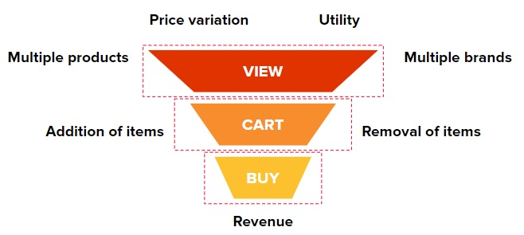
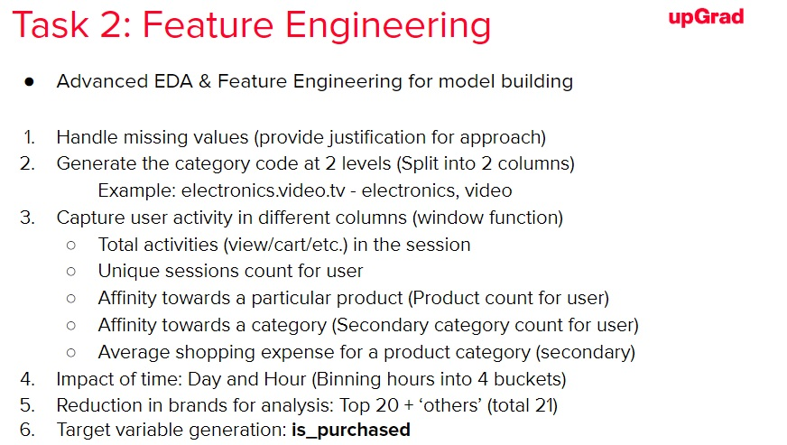
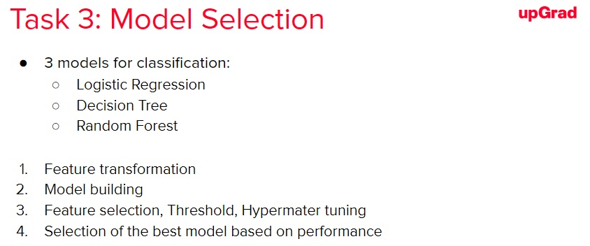
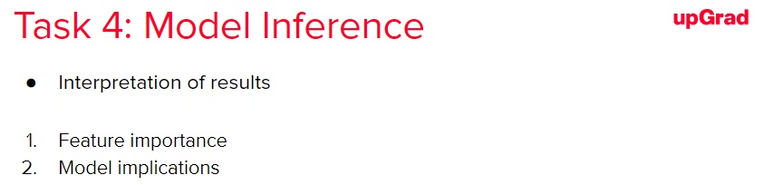

# E-Commerce churn Prediction (PySpark)

Churn prediction is one of the most common classification problems in the industry, especially in e-commerce. Many companies try to predict the purchase of an item based on customer behaviour. 

The sales funnel accurately captures the entire journey of a customer for the purchase made. It also reflects the notion that there is a drop in the number of users at every step and only a limited number of individuals out of the total reach the final stage of purchase (churn). Companies try to increase the efficiency of the sales funnel as it may result in more number of individuals reaching the final stage and help in increasing the revenue of the company.

build a model that predicts whether a person purchases an item present in his or her cart. The assignment is based on the final stage of the funnel, where a customer purchases an item that has been loaded in the cart.

## Dataset Attributes:
- event_time: Date and time when the user accesses the platform
- event_type: Action performed by the customer

    View
    Cart
    Purchase
    Remove from cart

- product_id: Unique number to identify the product in the event
- category_id: Unique number to identify the category of the product
- category_code: Stores primary and secondary categories of the product
- brand: Brand associated with the product
- price: Price of the product
- user_id: Unique ID for a customer
- user_session: Session ID for a use

## Expected Tasks

Four major tasks that you need to perform to complete the assignment:

1. Task 1: Data Exploration

2. Task 2: Feature Engineering

3. Task 3: Model Selection

4. Task 4: Model Inference

## Notebook Legend
Thee models were build using progessively complex algorithms, Logistic Regression, Decision Trees and RandomForest

1. Notebook 1: Data Exploration, Cleansing and Data preprocessing : Feature dtype correction, OneHotEncoding, finally writing dataframe to parquet file.
2. Notebook 2: Model building using Logistic Regression with model performance numbers.
3. Notebook 3: Model building using Decision Trees with performance numbers
4. Notebook 4: Model building using Random Forest with perf numbers.
5. Notebook 5: Model Selection and Feature Importances

